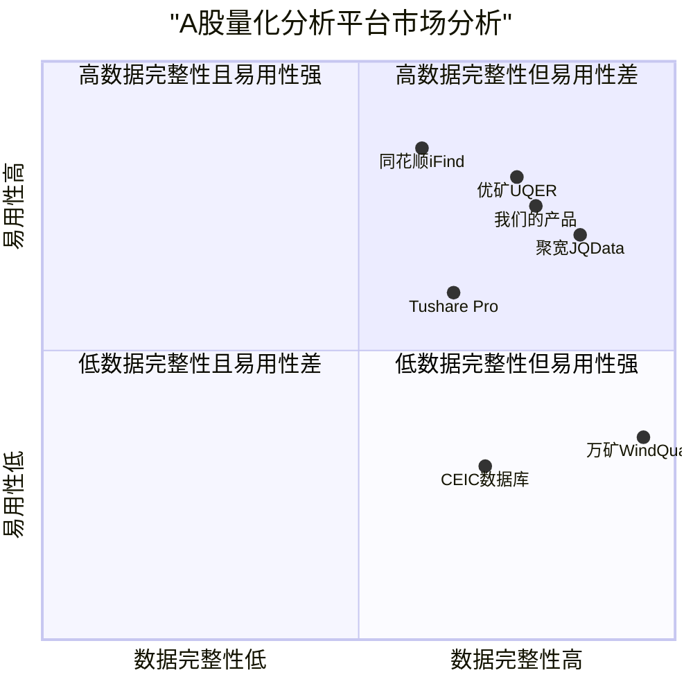

# 产品需求文档：基于AKShare API的量化分析平台

## 1. 项目信息

- **项目名称**：akshare_quant_platform
- **编程语言**：React, JavaScript, Tailwind CSS (前端)；Python (后端)
- **原始需求**：基于AKShare API创建一个全面的量化分析平台，使投资者能够进行A股市场的量化分析与交易策略研究

## 2. 产品定义

### 2.1 产品目标

1. **数据集成与可视化**：提供统一的数据获取界面，整合AKShare提供的丰富A股市场数据，并以直观的图表形式展示
2. **策略构建与回测**：支持用户基于多因子模型、技术分析、统计套利等方法构建策略，并进行历史回测分析
3. **投资决策支持**：通过数据分析和策略验证，为用户提供客观、量化的投资决策支持工具

### 2.2 用户故事

1. **作为量化研究人员**，我希望能轻松获取和处理A股全面的市场数据，以便进行深入的数据挖掘和因子分析
2. **作为投资分析师**，我希望能构建多因子模型并测试其有效性，以便找到有效的投资策略
3. **作为个人投资者**，我希望能使用技术指标和回测功能分析股票走势，以便优化我的交易决策
4. **作为基金经理**，我希望能进行股票组合的风险分析和业绩归因，以便优化投资组合
5. **作为金融机构研究员**，我希望能进行事件驱动分析，以便研究特定事件对股价的影响

### 2.3 竞争分析

| 产品名称 | 优势 | 劣势 |
|---------|------|------|
| **聚宽JQData** | 全面的数据接口、成熟的回测系统、详细的文档 | 价格较高、定制化能力有限 |
| **万矿WindQuant** | 强大的数据源、机构级数据精度、完整的金融工程工具 | 高昂的订阅费、学习曲线陡峭 |
| **优矿UQER** | 在线Python环境、简洁的API设计、社区和教程丰富 | 对高级策略支持有限、数据访问速度较慢 |
| **Tushare Pro** | 开源免费基础版、接口易用、社区活跃 | 高级数据收费、历史数据有限 |
| **CEIC数据库** | 宏观经济数据全面、数据权威 | 偏向宏观数据、微观数据不足、价格高 |
| **同花顺iFind** | 用户界面友好、终端操作便捷 | API灵活性不足、编程难度大 |
| **我们的产品** | 集成AKShare全面数据、开源无数据成本、灵活定制策略 | 作为新产品知名度不足、需要持续优化性能 |

### 2.4 竞争象限图



## 3. 技术规格

### 3.1 需求分析

基于AKShare API分析文档，平台需要支持以下核心功能：

1. **数据获取与处理**：整合AKShare提供的市场数据、基本面数据、交易行为数据、市场结构数据等
2. **量化策略开发**：支持多因子模型、技术分析、统计套利、事件驱动和机器学习等策略的开发
3. **回测系统**：提供历史数据回测，支持参数优化和性能评估
4. **风险分析**：提供投资组合风险评估和管理工具
5. **结果可视化**：以图表方式直观展示数据分析和回测结果
6. **A股特殊规则处理**：考虑T+1、涨跌停、最小交易单位等特殊规则

### 3.2 需求池

#### P0 (必要功能)

1. **AKShare数据接口集成**
   - 集成核心市场数据API：股票历史数据、实时数据、基本面数据
   - 自动处理数据清洗和标准化
   - 支持数据缓存和定期更新机制

2. **基础量化策略开发工具**
   - 技术指标计算库（移动平均线、MACD、RSI等）
   - 多因子模型构建框架
   - 信号生成和交易逻辑定义接口

3. **回测引擎**
   - 支持历史数据回测
   - 考虑交易成本和A股交易规则
   - 提供回测性能指标（年化收益、最大回撤、夏普比率等）

4. **用户界面与可视化**
   - 数据浏览和查询界面
   - 策略参数配置界面
   - 回测结果可视化图表

#### P1 (重要功能)

5. **高级策略开发工具**
   - 统计套利模型框架
   - 事件研究工具
   - 机器学习模型集成

6. **投资组合优化**
   - 风险度量和管理工具
   - 投资组合构建和优化功能
   - 业绩归因分析

7. **高级可视化与报告**
   - 交互式策略分析图表
   - 策略性能监控仪表板
   - 可导出的研究报告

8. **数据增强功能**
   - 多数据源对比和验证
   - 自定义因子构建工具
   - 更新提醒和异常检测

#### P2 (可选功能)

9. **实时策略监控**
   - 盘中策略表现监控
   - 指标警报系统

10. **高级回测功能**
    - 蒙特卡洛模拟
    - 敏感性分析
    - 交易执行延迟模拟

11. **社区与分享功能**
    - 策略分享和讨论平台
    - 量化研究资源库

12. **API扩展系统**
    - 支持自定义数据源集成
    - 第三方工具连接接口

### 3.3 UI设计草图

#### 主界面布局

```
+-----------------------------------------------------------------------+
|                           顶部导航栏                                    |
| [数据中心] [策略开发] [回测分析] [投资组合] [研究报告] [设置]            |
+-----------------------------------------------------------------------+
|                                                                       |
|  +-------------------+   +--------------------------------------+     |
|  |                   |   |                                      |     |
|  | 数据/策略选择面板  |   |           主内容显示区域              |     |
|  |                   |   |                                      |     |
|  | - 数据类别        |   |   [数据可视化/策略编辑/回测结果]      |     |
|  | - 常用策略        |   |                                      |     |
|  | - 自定义策略      |   |                                      |     |
|  |                   |   |                                      |     |
|  +-------------------+   +--------------------------------------+     |
|                                                                       |
|  +---------------------------------------------------------------+   |
|  |                       底部状态栏/结果摘要                      |   |
|  +---------------------------------------------------------------+   |
|                                                                       |
+-----------------------------------------------------------------------+
```

#### 数据中心页面

```
+-----------------------------------------------------------------------+
| 数据中心                                                   [刷新][导出] |
+-----------------------------------------------------------------------+
|  +-------------------+   +--------------------------------------+       |
|  |                   |   |                                      |       |
|  | 数据类别          |   |           数据预览表格/图表           |       |
|  | ☐ 市场数据        |   |                                      |       |
|  | ☐ 基本面数据      |   |                                      |       |
|  | ☐ 交易行为数据    |   |                                      |       |
|  | ☐ 市场结构数据    |   |                                      |       |
|  | ☐ 衍生品数据      |   |                                      |       |
|  | ☐ 宏观经济数据    |   |                                      |       |
|  |                   |   |                                      |       |
|  | 数据区间:         |   |                                      |       |
|  | [日期选择器]      |   |                                      |       |
|  |                   |   |                                      |       |
|  | 股票选择:         |   |                                      |       |
|  | [代码/名称搜索]   |   |                                      |       |
|  |                   |   |                                      |       |
|  +-------------------+   +--------------------------------------+       |
|                                                                         |
| 数据API: stock_zh_a_hist() | 上次更新: 2025-05-20 15:30                 |
+-----------------------------------------------------------------------+
```

#### 策略开发页面

```
+-----------------------------------------------------------------------+
| 策略开发                                        [保存][回测][部署]     |
+-----------------------------------------------------------------------+
|  +-------------------+   +--------------------------------------+       |
|  |                   |   |                                      |       |
|  | 策略模板          |   |           策略代码编辑器             |       |
|  | ☐ 技术分析        |   |                                      |       |
|  | ☐ 多因子模型      |   |   def strategy(data):                |       |
|  | ☐ 统计套利        |   |       # 策略逻辑                     |       |
|  | ☐ 事件驱动        |   |       pass                           |       |
|  | ☐ 机器学习        |   |                                      |       |
|  |                   |   |                                      |       |
|  | 参数设置:         |   |                                      |       |
|  | 参数1: [   ]      |   |                                      |       |
|  | 参数2: [   ]      |   |                                      |       |
|  |                   |   |                                      |       |
|  | 数据选择:         |   |                                      |       |
|  | [数据源选择器]    |   |                                      |       |
|  |                   |   |                                      |       |
|  +-------------------+   +--------------------------------------+       |
|                                                                         |
| 策略ID: strategy_001 | 创建日期: 2025-05-20                            |
+-----------------------------------------------------------------------+
```

#### 回测分析页面

```
+-----------------------------------------------------------------------+
| 回测分析                                       [参数优化][导出报告]     |
+-----------------------------------------------------------------------+
|  +-------------------+   +--------------------------------------+       |
|  |                   |   |                                      |       |
|  | 回测设置          |   |         回测结果图表显示区域          |       |
|  | 开始日期:         |   |                                      |       |
|  | [日期选择器]      |   |  [收益曲线/回撤/风险指标等图表]      |       |
|  | 结束日期:         |   |                                      |       |
|  | [日期选择器]      |   |                                      |       |
|  |                   |   |                                      |       |
|  | 初始资金:         |   |                                      |       |
|  | [金额输入]        |   |                                      |       |
|  |                   |   |                                      |       |
|  | 交易成本:         |   |                                      |       |
|  | 买入: [  ]%       |   |                                      |       |
|  | 卖出: [  ]%       |   |                                      |       |
|  |                   |   |                                      |       |
|  +-------------------+   +--------------------------------------+       |
|                                                                         |
| 性能指标: 年化收益率: 15.2% | 最大回撤: 8.5% | 夏普比率: 1.85          |
+-----------------------------------------------------------------------+
```

### 3.4 开放问题

1. **数据一致性与延迟问题**
   - 如何处理AKShare API可能存在的延迟和速率限制?
   - 如何验证不同数据源之间的数据一致性?

2. **性能与可扩展性**
   - 当处理大量历史数据时，系统如何保持响应速度?
   - 如何设计系统架构以支持未来功能扩展?

3. **A股特殊规则处理**
   - 如何准确模拟涨跌停、T+1、停牌等A股特殊规则?
   - 如何处理股票分红、配股等公司行为的数据调整?

4. **机器学习策略的实现**
   - 如何平衡机器学习模型的复杂性与过拟合风险?
   - 如何高效实现特征工程和模型训练?

5. **用户体验与学习曲线**
   - 如何降低量化分析的技术门槛，使产品对非专业用户更友好?
   - 是否需要提供策略模板库以帮助用户快速入门?

## 4. 交付计划

### 阶段一：基础平台构建 (2个月)
- 搭建核心架构和数据处理框架
- 实现AKShare API集成和基础数据处理功能
- 开发基本的UI界面和数据可视化组件

### 阶段二：核心功能开发 (3个月)
- 实现技术分析和多因子模型构建功能
- 开发回测引擎和基础性能评估工具
- 完善用户界面和交互体验

### 阶段三：高级功能与优化 (3个月)
- 实现统计套利和事件驱动策略功能
- 添加投资组合优化和风险管理工具
- 开发高级可视化和报表功能
- 系统性能优化和稳定性测试

### 阶段四：扩展功能与公测 (2个月)
- 实现机器学习策略支持
- 添加社区和分享功能
- 进行公开测试和用户反馈收集
- 基于反馈进行系统优化和完善

## 5. 产品成功指标

1. **功能完整性**：成功集成90%以上的AKShare核心API
2. **策略有效性**：提供至少10种预置策略模板，每种策略在回测中超越基准指数
3. **性能指标**：
   - 数据查询响应时间<2秒
   - 一般回测运行时间<30秒（对于10年数据的日线级别回测）
4. **用户指标**：
   - 公测阶段吸引500+专业用户
   - 用户满意度>4.0（5分制）
5. **系统稳定性**：
   - 系统正常运行时间>99.5%
   - 数据更新成功率>99%

## 6. 参考资料

1. AKShare API文档与示例
2. A股市场交易规则文档
3. 量化投资策略理论资料
4. 竞品功能与用户体验分析报告